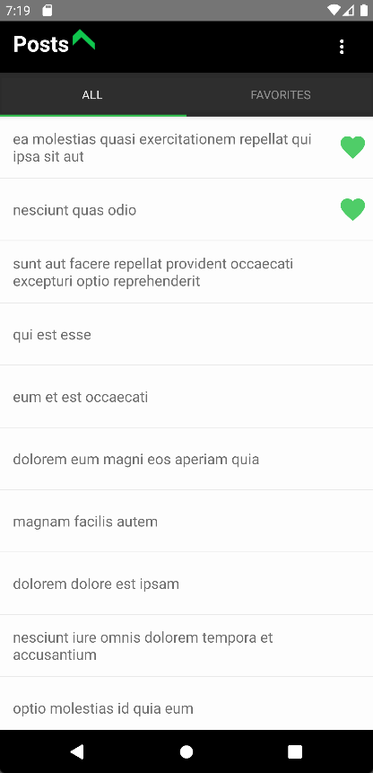

## Zemoga React Native Test
A simple mobile app written in React Native to read posts from [JSONPlaceholder](https://jsonplaceholder.typicode.com/) with offline and lazy-loading support.

## Table of Contents
- [Installation](#installation)
- [Dependencies](#dependencies)
- [Structure](#structure)
- [How it works](#how-it-works)
- [Screenshoots](#screenshoots)
- [Became a sponsor](#became-a-sponsor)

## Installation
```
$ git clone https://github.com/grissproject/reactnative-posts.git
$ cd reactnative-posts
```
Make sure that you have NodeJS 14+, Xcode (ios) and Android SDK (android) installed.

### ios
```
$ yarn install
$ cd ios && pod install && cd ..
$ npx react-native run-ios
```

### android
```
$ yarn install
$ npx react-native run-android
```

## Dependencies
- [React Navigation](https://github.com/react-navigation/react-navigation). Routing and navigation managment.
- [Realm](https://github.com/realm/realm-js). Database for offline support. I've choosen it over other alternatives (such as Redux Persist or React Query) because it **makes easy** to build reactive apps with offline-first experiences.
- [Axios](https://github.com/axios/axios). Promise based HTTP client. Even do (Fetch API)[https://developer.mozilla.org/en-US/docs/Web/API/Fetch_API] would be enough for this project (we are not taking advantages of axios' features), this is a more future-proof aproach.
- [React Native Gesture Handler](https://github.com/software-mansion/react-native-gesture-handler). Native-driven gesture management APIs (gestures are not controlled by the JS responder system). Used to add _LIKE_ and _DELETE_ actions on left/right swipe.
- [React Native Vector Icons](https://github.com/oblador/react-native-vector-icons). Bring icons to the app!
Other packages in the "dependencies" list are just dependencies of these ones.

## Structure
* **./src**
  - **api**. Contains calls to JSONPlaceholder using axios.
  - **components**
    - **commnon**. All generic components are placed here. I have wrapped the **View** and **Text** native components in order to reuse common styles throughout the app. For example, we don't need to define the default text color or size over and over again but we keep it consistent. This works very well in this small app, but probably on a larger project it would be better to choose a themed UI library (or write better/more-customizable common components).
    - **posts**, **comments**, **users**. Components for each object type.
  - **hooks**. App hooks. The app rely mostly on hooks to access the data. This prevents from quering data from components and allow us to have a unique source of data (through Context). This is a cleaner approach than having and state manager (such as redux or mobx).
  - **navigation**. Stacks and Tabs Navigators lives here. I have custom files for iOS & android Tabs.
  - **screens**. App screens that are used by the navigator. Also Header files.
  - **storage**. Realm's object model and context. Currently, only Posts are being stored in the database, users and comments are queried from JSONPlaceholder.
  - **theme**. Common colors, sizes and images. I use these configuration through *useTheme* hook instead of direct file import. Even do the hook is not necesary (since we are not really supporting themes but directly exposing these objects) this hooks-approach allows us to add theme support in the future without changing every single file.

## How it works
The **usePosts** hook retrieves the posts from JSONPlaceholder in the first load (through ```useEffect(() => {}, [])```) and saves the result in the Realm database (adding the *favorite=false* flag). Then it queries to the database and exposes the result to the whole APP through a Context. To improve performance, initially it only gets 20 results and goes increasing as the user scrolls down the list. When the user *reloads*, the app retrieves again the posts from JSONPlaceholder and only adds the missing posts to the database. All UI components were written from scratch.

I've first created a very basic but working approach using expo and react-native-elements. No offline support, no gestures. Just for the record, I've uploaded to [https://github.com/grissproject/reactnative-posts-expo](https://github.com/grissproject/reactnative-posts-expo).

## Screenshoots

 

## Became a sponsor
If you enjoyed the app, please consider becoming a sponsor --(yeah... I mean to hire me :)--
